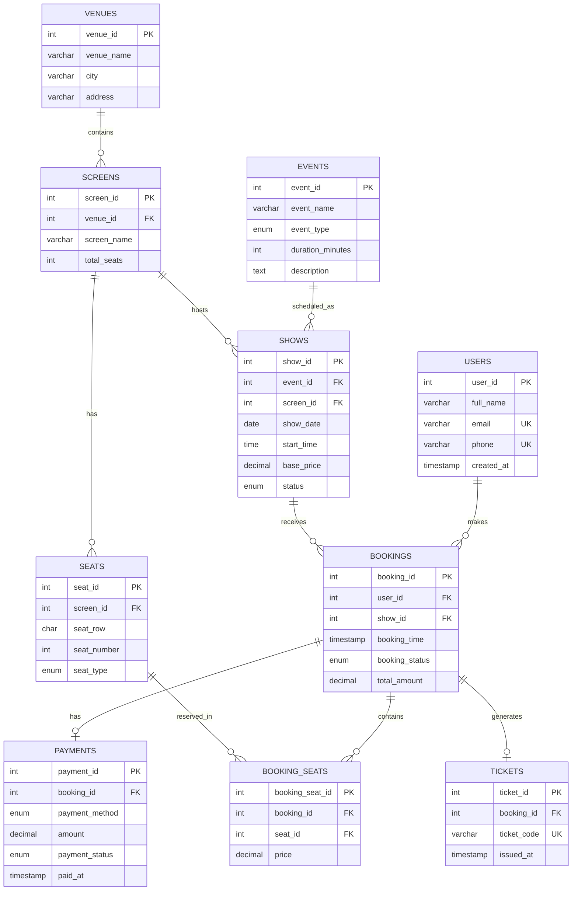

# ER Diagram

```mermaid
erDiagram
    USERS ||--o{ BOOKINGS : makes
    VENUES ||--o{ SCREENS : contains
    SCREENS ||--o{ SEATS : has
    EVENTS ||--o{ SHOWS : scheduled_as
    SCREENS ||--o{ SHOWS : hosts
    SHOWS ||--o{ BOOKINGS : receives
    BOOKINGS ||--o{ BOOKING_SEATS : contains
    SEATS ||--o{ BOOKING_SEATS : reserved_in
    BOOKINGS ||--o| PAYMENTS : has
    BOOKINGS ||--o| TICKETS : generates

    USERS {
        int user_id PK
        varchar full_name
        varchar email UK
        varchar phone UK
        timestamp created_at
    }

    VENUES {
        int venue_id PK
        varchar venue_name
        varchar city
        varchar address
    }

    SCREENS {
        int screen_id PK
        int venue_id FK
        varchar screen_name
        int total_seats
    }

    SEATS {
        int seat_id PK
        int screen_id FK
        char seat_row
        int seat_number
        enum seat_type
    }

    EVENTS {
        int event_id PK
        varchar event_name
        enum event_type
        int duration_minutes
        text description
    }

    SHOWS {
        int show_id PK
        int event_id FK
        int screen_id FK
        date show_date
        time start_time
        decimal base_price
        enum status
    }

    BOOKINGS {
        int booking_id PK
        int user_id FK
        int show_id FK
        timestamp booking_time
        enum booking_status
        decimal total_amount
    }

    BOOKING_SEATS {
        int booking_seat_id PK
        int booking_id FK
        int seat_id FK
        decimal price
    }

    PAYMENTS {
        int payment_id PK
        int booking_id FK
        enum payment_method
        decimal amount
        enum payment_status
        timestamp paid_at
    }

    TICKETS {
        int ticket_id PK
        int booking_id FK
        varchar ticket_code UK
        timestamp issued_at
    }
```
